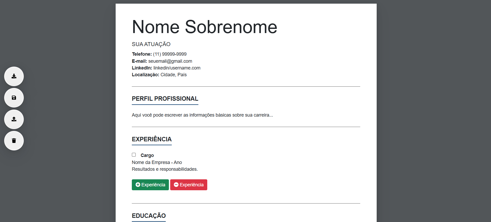

# Gerador de Currículo
Este projeto é um gerador de currículo que permite aos usuários criarem, editarem e exportarem seus currículos em formato PDF.

## Funcionalidades
- **Edição direta no navegador**: Os campos são editáveis diretamente na página.
- **Salvar e carregar dados**: Possibilidade de salvar as informações no navegador, salvar um backup.txt e carregar posteriormente.
- **Exportar para PDF**: - Geração de um arquivo PDF do currículo criado com texto selecionável. 
                         - O problema do autobreak e breakpage foi resolvido utilizando um "breakpage" manual no jsPDF, garantindo que o texto não seja cortado no meio do PDF gerado.
- **Importar backup**: Permite importar arquivos.txt de backup. 
- **Adicionar e remover seções**: Possibilidade de adicionar novas experiências, habilidades e outras informações.

## Tecnologias Utilizadas
- **HTML5**
- **CSS3**
- **Bootstrap 5** (para estilização responsiva).
- **FontAwesome** (para ícones).
- **JavaScript** (para funcionalidades dinâmicas).
- **html2canvas** e **jsPDF** (para geração de PDF).

## Prévia do Projeto

