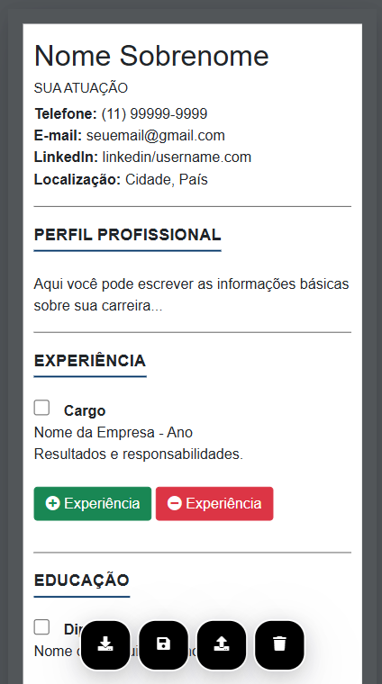

# Gerador de Currículo
Este projeto é um gerador de currículos no modelo ATS, permitindo que os usuários criem, editem e exportem seus currículos em formato PDF, tudo no client-side (lado do cliente) diretamente no navegador.

## Link
https://alantbarboza.github.io/gerador-curriculo-pdf/

## Funcionalidades
- **Edição direta no navegador**: Os campos são editáveis diretamente na página.
- **Salvar e carregar dados**: Possibilidade de salvar as informações no navegador (local storage), salvar um backup.txt e carregar posteriormente.
- **Exportar para PDF**: Geração de um PDF do currículo com texto selecionável e quebra de página para evitar cortes no meio do conteúdo.
- **Importar backup**: Permite importar arquivos.txt de backup. 
- **Adicionar e remover seções**: Possibilidade de adicionar novas experiências, habilidades e outras informações.

## Tecnologias Utilizadas
- **HTML5**
- **CSS3**
- **Bootstrap 5** (para estilização responsiva).
- **FontAwesome** (para ícones).
- **JavaScript** (para funcionalidades dinâmicas).
- **html2canvas** e **jsPDF** (para geração de PDF).

## Prévia do Projeto

